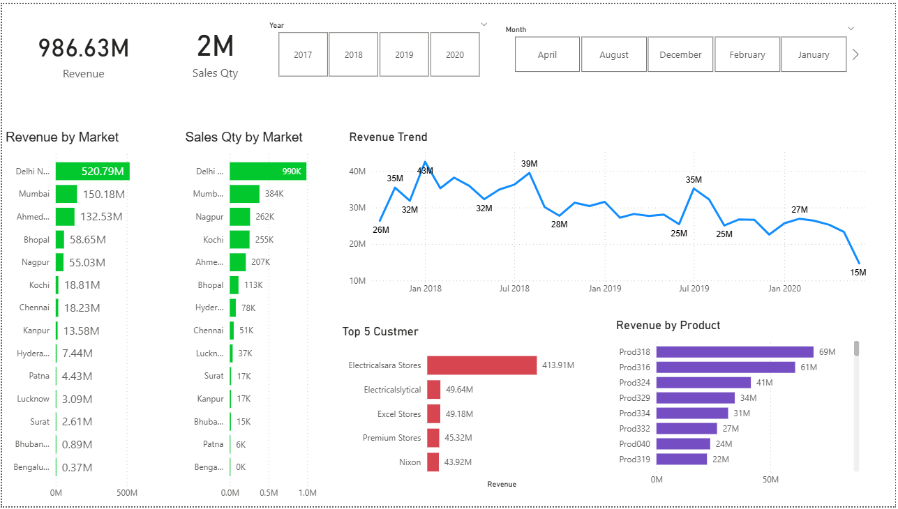

# End-to-End Sales Data Pipeline & Analytics (MySQL → Power BI)

This project demonstrates the design and implementation of an end-to-end data pipeline that transforms raw transactional data into structured analytical datasets and interactive business dashboards. It covers data modeling (star schema), data transformation, and visualization to support data-driven decision-making.

---

## Project Overview

**Tools Used:** MySQL, Power BI  
**Project Type:** Data Analytics / Data Engineering (BI Pipeline)

The dataset was provided as a SQL dump file and imported into MySQL. The data was then explored, structured, and transformed before being connected to Power BI for building interactive dashboards.

---

## Dashboard Preview

---

## Data Engineering Workflow

1. Imported raw transactional data into a MySQL database  
2. Explored and validated data using SQL queries (joins, aggregations)  
3. Designed a **star schema data model** (fact and dimension tables)  
4. Performed data cleaning and transformation using Power Query  
5. Established a connection between MySQL and Power BI  
6. Built an interactive dashboard for reporting and analysis  

---

## Data Modeling

- Implemented a **star schema** with fact and dimension tables  
- Structured data to optimize analytical queries and reporting performance  
- Enabled efficient slicing of data across time, products, customers, and markets  

---

## Dashboard Features

- Total Revenue and Sales Quantity KPIs (~986M revenue, ~2M Sales Quantity)  
- Revenue and sales distribution by market/region  
- Top customers by revenue contribution  
- Product-wise performance analysis  
- Monthly and yearly sales trends  
- Interactive filters (year and month slicers)  

---

## Data Engineering Perspective

- Designed a structured data model to support scalable analytics  
- Built a data flow from database (MySQL) to visualization layer (Power BI)  
- Applied data transformation techniques to convert raw data into analysis-ready format  
- Simulated a real-world reporting pipeline used in business intelligence systems  

---

## Skills Demonstrated

- Writing SQL queries for data extraction, joins, and aggregations  
- Designing star-schema data models (fact & dimension tables)  
- Data transformation and preprocessing using Power Query  
- Building KPI-driven dashboards in Power BI  
- Connecting relational databases to BI tools for end-to-end reporting workflows  
- Applying business logic to generate actionable insights  

---

## Business Impact

- Enabled visibility into ~986M total revenue and ~2M sales records  
- Identified high-performing products, customers, and markets  
- Supported data-driven decision-making through interactive dashboards  
- Improved understanding of sales trends and performance patterns  

---

## Repository Structure

- `data/` → SQL dump file (sales_database_dump.sql)  
- `dashboard/` → Power BI dashboard file (sales_dashboard.pbix)  
- `screenshots/` → Dashboard preview images  
- `README.md` → Project documentation  

---

## How to Run

1. Create or open a MySQL database and import the SQL dump file  
2. Open the Power BI (.pbix) file  
3. Update database connection details if required  
4. Refresh the data to load it from MySQL  
5. Explore the interactive dashboard  

---

## Example Use Cases

- Monitoring overall sales performance  
- Identifying high-value customers and key markets  
- Tracking revenue trends over time  
- Analyzing product contribution to revenue  

---

## Author

**Yadnyesh Thakare**  
LinkedIn: https://linkedin.com/in/yadnyesh-thakare/  
Email: thakareyadnyesh@gmail.com  

---

## Summary

This project demonstrates a practical implementation of a data pipeline and analytics workflow, converting raw database records into structured insights and business dashboards. It reflects real-world reporting and data processing tasks commonly used in analytics and data engineering roles.
